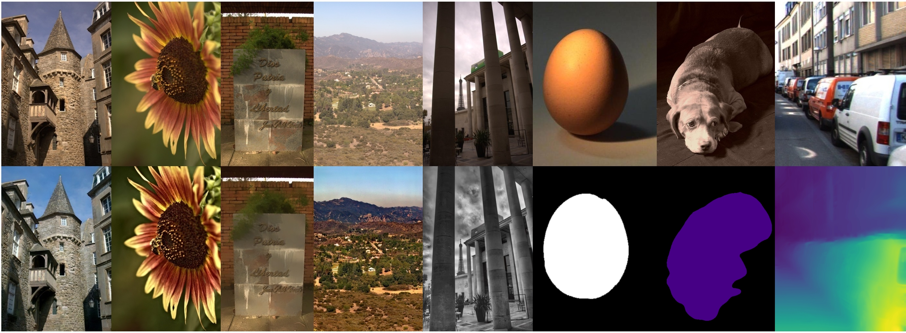

# Fast End-to-End Trainable Guided Filter
[[Project]](http://wuhuikai.me/DeepGuidedFilterProject)    [[Paper]](http://wuhuikai.me/DeepGuidedFilterProject/deep_guided_filter.pdf)    [[arXiv]](https://arxiv.org/abs/1803.05619)    [[Demo]](http://wuhuikai.me/DeepGuidedFilterProject#demo)    [[Home]](http://wuhuikai.me)
  
Official implementation of **Fast End-to-End Trainable Guided Filter**.     
**Faster**, **Better** and **Lighter**  for image processing and dense prediction. 

## Overview


**DeepGuidedFilter** is the author's implementation of the deep learning building block for joint upsampling described in:  

**Fast End-to-End Trainable Guided Filter**     
Huikai Wu, Shuai Zheng, Junge Zhang, Kaiqi Huang    
CVPR 2018

Given a reference image pair in high-resolution and low-resolution, our algorithm generates high-resolution target from the low-resolution input. Through joint training with CNNs, our algorithm achieves the state-of-the-art performance while runs **10-100** times faster. 

Contact: Hui-Kai Wu (huikaiwu@icloud.com)

## Try it on an image!
### Prepare Environment
1. Download source code from GitHub.
    ```sh
    git clone https://github.com/wuhuikai/DeepGuidedFilter
    
    cd DeepGuidedFilter && git checkout release
    ```
2. Install dependencies (PyTorch version).
    ```sh
    conda install opencv
    conda install pytorch=0.2.0 cuda80 -c soumith
    
    pip install -r requirements.txt 
    ```
3. (**Optional**) Install dependencies for MonoDepth (Tensorflow version).
    ```sh
    cd ComputerVision/MonoDepth
    
    pip install -r requirements.txt
    ```
### Ready to **GO** !
#### Image Processing
```sh
cd ImageProcessing/DeepGuidedFilteringNetwork

python predict.py  --task auto_ps \
                   --img_path ../../images/auto_ps.jpg \
                   --save_folder . \
                   --model deep_guided_filter_advanced \
                   --low_size 64 \
                   --gpu 0
```
See [Here](ImageProcessing/DeepGuidedFilteringNetwork/#predict) or `python predict.py -h` for more details.
#### Semantic Segmentation with Deeplab-Resnet
1. Enter the directory.
    ```sh
    cd ComputerVision/Deeplab-Resnet
    ```
2. Download the pretrained model [[Google Drive](https://drive.google.com/open?id=1YXZoZIZNR1ACewiUBp4UDvo_P65cCooK)|[BaiduYunPan](https://pan.baidu.com/s/1dEnpcGfchlZA_fVGdve0ig)].
3. Run it now !
    ```sh
    python predict_dgf.py --img_path ../../images/segmentation.jpg --snapshots [MODEL_PATH]
    ```
Note:
1. Result is in `../../images`.
2. Run `python predict_dgf.py -h` for more details.
#### Saliency Detection with DSS
1. Enter the directory.
    ```sh
    cd ComputerVision/Saliency_DSS
    ```
2. Download the pretrained model [[Google Drive](https://drive.google.com/open?id=1ZxbAAJw9BxCKj2e2QsBmCnjWLFlCGLf1)|[BaiduYunPan](https://pan.baidu.com/s/1pgOMh3V50lRa6slbIW_SKQ)].
3. Try it now !
    ```sh
    python predict.py --im_path ../../images/saliency.jpg \
                      --netG [MODEL_PATH] \
                      --thres 161 \
                      --dgf --nn_dgf \
                      --post_sigmoid --cuda
    ```
Note:
1. Result is in `../../images`.
2. See [Here](ComputerVision/Saliency_DSS/#try_on_an_image) or `python predict.py -h` for more details.
#### Monocular Depth Estimation (TensorFlow version)
1. Enter the directory.
    ```sh
    cd ComputerVision/MonoDepth
    ```
2. **Download** and **Unzip** Pretrained Model [[Google Drive](https://drive.google.com/file/d/1dKDYRtZPahoFJZ5ZJNilgHEvT6gG4SC6/view?usp=sharing)|[BaiduYunPan](https://pan.baidu.com/s/1-GkMaRAVym8UEmQ6ia5cHw)]
2. Run on an Image !
    ```sh
    python monodepth_simple.py --image_path ../../images/depth.jpg --checkpoint_path [MODEL_PATH] --guided_filter
    ```
Note:
1. Result is in `../../images`.
2. See [Here](ComputerVision/MonoDepth/#try_it_on_an_image) or `python monodepth_simple.py -h` for more details.

## Guided Filtering Layer
### Install Released Version
* PyTorch Version
    ```sh
    pip install guided-filter-pytorch
    ```
* Tensorflow Version
    ```sh
    pip install guided-filter-tf
    ```
### Usage
* PyTorch Version
    ```python
    from guided_filter_pytorch.guided_filter import FastGuidedFilter
    
    hr_y = FastGuidedFilter(r, eps)(lr_x, lr_y, hr_x)
    ```
    ```python
    from guided_filter_pytorch.guided_filter import GuidedFilter
    
    hr_y = GuidedFilter(r, eps)(hr_x, init_hr_y)
    ``` 
* Tensorflow Version
    ```python
    from guided_filter_tf.guided_filter import fast_guided_filter
    
    hr_y = fast_guided_filter(lr_x, lr_y, hr_x, r, eps, nhwc)
    ```
    ```python
    from guided_filter_tf.guided_filter import guided_filter
    
    hr_y = guided_filter(hr_x, init_hr_y, r, eps, nhwc)
    ```
## Training from scratch
### Prepare Training Environment
```sh
git checkout master

conda install opencv
conda install pytorch=0.2.0 cuda80 -c soumith
    
pip install -r requirements.txt

# (Optional) For MonoDepth (TF Version).
pip install -r ComputerVision/MonoDepth/requirements.txt 
```
### Start to Train
* [Image Processing](ImageProcessing/DeepGuidedFilteringNetwork)
* [Semantic Segmentation with Deeplab-Resnet](ComputerVision/Deeplab-Resnet)
* [Saliency Detection with DSS](ComputerVision/Saliency_DSS)
* [Monocular Depth Estimation (TensorFlow version)](ComputerVision/MonoDepth)

## Citation
```
@inproceedings{wu2017fast,
  title     = {Fast End-to-End Trainable Guided Filter},
  author    = {Wu, Huikai and Zheng, Shuai and Zhang, Junge and Huang, Kaiqi},
  booktitle = {CVPR},
  year = {2018}
}
```